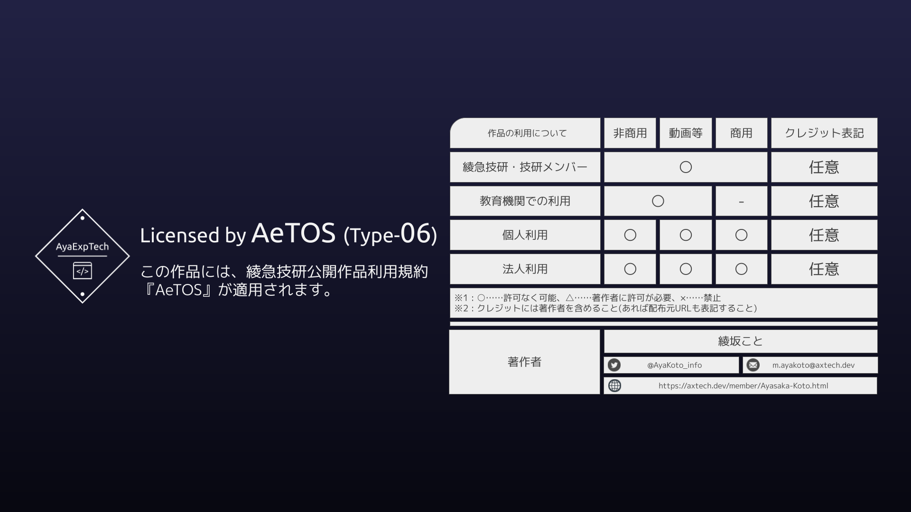

# AXT-HTMLmail-TableLayout

HTMLメールに使える「テーブルレイアウト」の簡易作例集です。

## 内容物

index.html

- すべてが入っています。
- `tr.section`がパーツです。この中から使いたいパーツをコピペすれば使えます。

## パーツ一覧

| パーツ名 | パーツ内容 |
|:----:|:----:|
| space | 空白セクション |
| header | ロゴ+タイトル |
| caption | 注釈・引用など |
| title | 見出し |
| image | 横いっぱいに画像を置く |
| headLine | 小見出し |
| text | 横いっぱいにテキストを置く |
| description | 画像+テキストの横並び |
| divisions | 3分割の画像+見出し+文章セクション |

## 注意

- このレイアウト手法をwebページで利用することは避けてください。
    - webページではデザインをCSSに任せるべきです
    - 配置のレイアウトもflexboxやgridを使いましょう
    - HTMLメールの場合は新しい仕様に対応していないメーラーが多いためにこんなことになっています
    - 本来は非推奨なものも使っていることを留意してください。
- クラスに重要な意味はありません。
    - どうせ外部CSSは読み込めないのでclassをつける意義があまりありません

## 規約

Author : 綾坂こと (Ayasaka-Koto)  
Licensed by "AeTOS(Type-06)"

